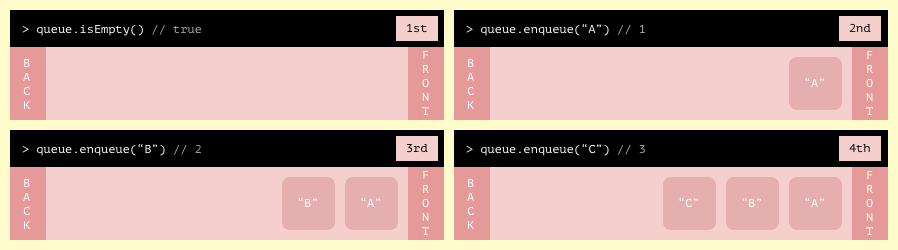
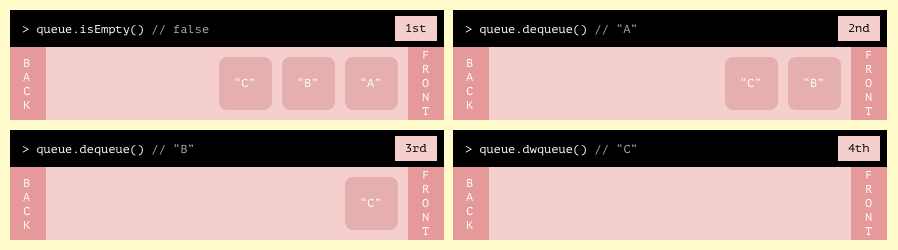

# Queue
  

## What is a queue? 
The queue abstrat data structure is used to store information in a manner where the first item stored in the queue will be the first item retrieved. Often refered to as "first in first out" or FIFO. It works just like a queue of people waiting to board a plane. The first person to show up in the queue is the first person to get on the plain. The order of the people enter and exit the queue is exactly the same.  

### Interface requirements
* A queue allways has `enqueue` and `dequeue` methods for adding and removing items to the back of the queue.
* A queue sometimes has an `isEmpty` method

### add data with `queue.enqueue`

The enqueue method adds a value to the back of the queue and then returns the number of items in the queue

### Remove and retrieve data with `queue.dequeue`

The dequeue method removes and retrieves a value from the front of the queue. If the queue is empty the queue will return null.

### `queue.isEmpty`
The isEmpty method will return true only if the queue has no stored values.

# What are common use cases for queues?
* Handling asyncronous code execution for example javascript uses a callback queue
* Queues can be used to create [channels](https://en.wikipedia.org/wiki/Channel_(programming)) for passing messages between multipull processes or threads
* Handing requests to a web server
* Handling interrupts in a operating system
* Managing requests to a physical resource for example manging print jobs to a printer, or managing packets to a router
