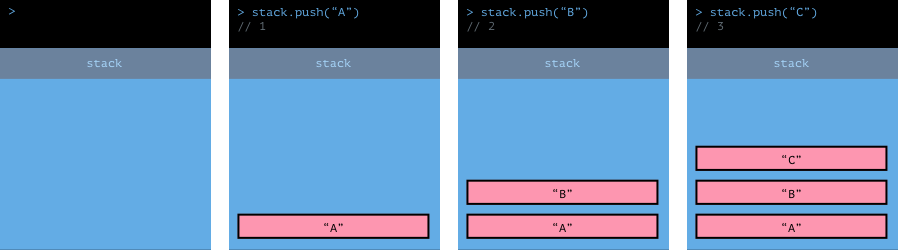
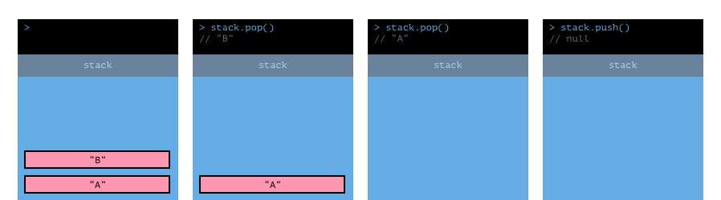
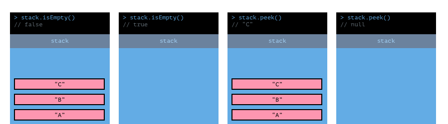

# Stack

## What is a stack? 
The stack abstract data structure is used to store information in a manner where the first item stored in the stack will be the last item retrieved from the stack. Often referd to as "fist in last out" or FILO. It works works just like a stack of trays in a cafeteria. a tray stack only allows you to put a tray on top of the stack or remove a tray from the top of the stack, where trays in the middle of the stack are unaccecable.   

### Interface requirements
* A stack allways has `push` and `pop` methods for adding and removing items "from the top of the stack".   
* A stack sometimes has a peek method for retrieving the top value on the stack **without** removing it.
* A stack sometimes has an isEmpty method that returns a boolean value, returning `true` only if the stack has zero items.

### Add data with `stack.push`

The push method takes in a value as an argument to add onto the top of the stack and then returns the number of items in the stack.

### Remove and retrieve data with `stack.pop`

The pop method removes and returns a value from the top of the stack. If the stack is empty the stack will return null.

### Using `stack.isEmpty` and `stack.peek`

The isEmpty method will return `true` if the stack is Empty and `false` otherwise.   

The peek method returns a value from the top of the stack **without** removing it from the stack.   

# What are common use cases for stacks?
* Two stacks are often used to implament Undo and Redo
* Stacks are used to manage memory at compile time in many programing languages
* Many CISC processors have dedicated calls stacks for managing instruction execution
* Many programming langues use call stacks for managing subroutines  
* Stacks can be used in brace brace matching and palindrome validation algorithms
